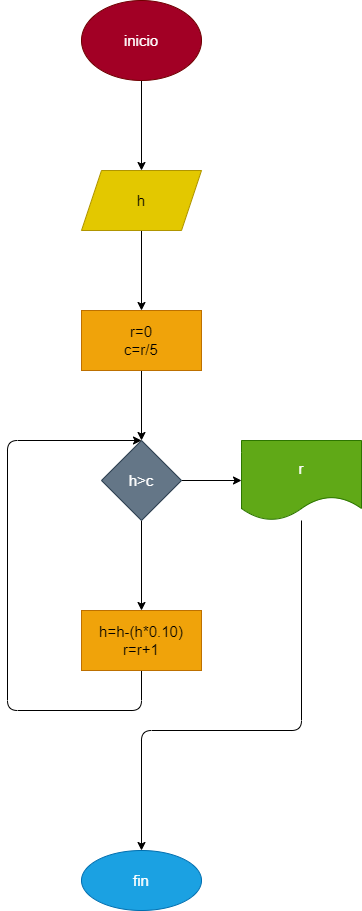

# Rebote_pelota

# Ejercicio N. 2. repeticiones: una pelota se deja caer desde una altura h, y en cada rebote sube el 10% menos del anterior. hacer el diagrama de flujo y el programa en python, que lea h y que calcule e imprima en cual renbote la pelota no alcanza a subir la quita parte de la altura inicial. 

## Diagrama de flujo 